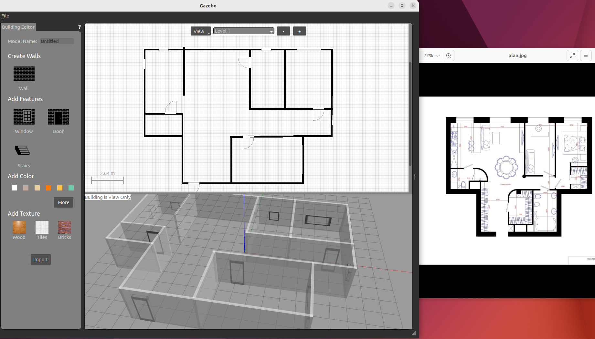
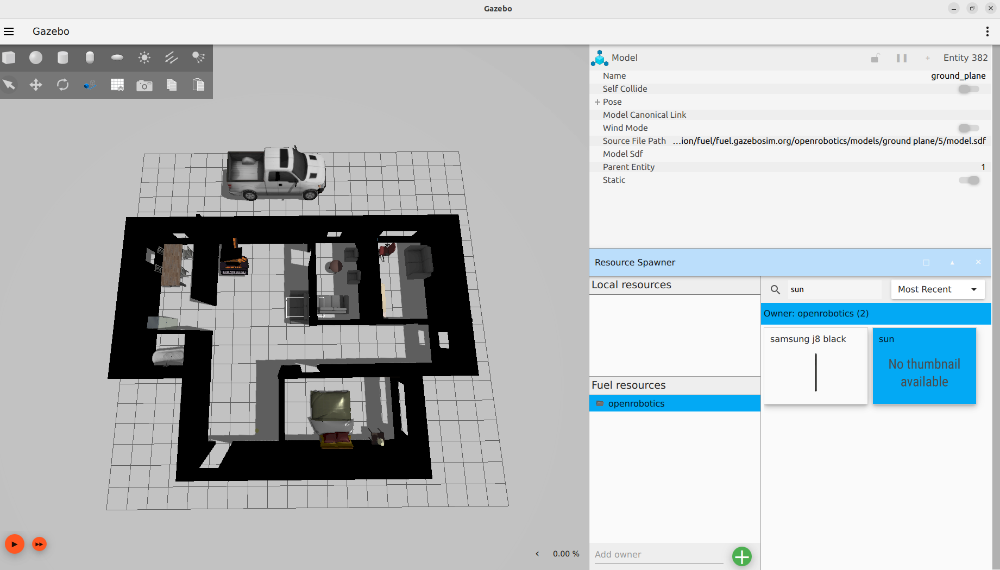

# Gazebo House ROS2

Используемое ПО:
- [Ubuntu 22.04.5 LTS (Jammy Jeelyfish)](https://releases.ubuntu.com/jammy/)
- [VirtualBox 7.1.4](https://www.virtualbox.org/wiki/Downloads)
- [Gazebo Classic 11.0.0](https://classic.gazebosim.org/download)
- [ROS2 Humble](https://docs.ros.org/en/humble/Installation.html)
- [Gazebo Ignition 6.16.0](https://gazebosim.org/api/gazebo/6/install.html)

## Этапы работы

### Создание плана квартиры 

1. Запуск графического интерфейса Gazebo с помощью команды 
```console
gazebo
```
2. Запускаю в меню Edit -> Building Editor. Настраиваю масштаб рабочего пространства
3. С помощью инструментов `Wall`, `Door` и `Window` чертится 2D-макет по выбранному плану квартиры, снизу также отображается модель

4. После сохранения проекта получаются два файла - *model.config* и *model.sdf*

### Загрузка квартиры в Gazebo Ignition
1. Создание в той же директории файла *world.sdf*. Запуск мира в Ignition Gazebo командой
```console
ign gazebo world.sdf 
```
2. Установка в мире элементов интерьера, мебели, пола и источника света


### Запуск симуляции в turtlebot 4
1. Создание рабочего пространства:
```console
mkdir -p ~/project/vlbarsegyan/turtlebot4_ws/src
cd ~/project/vlbarsegyan/turtlebot4_ws/src
git clone https://github.com/turtlebot/turtlebot4.git
cd ..
colcon build --symlink-install
```

### Запуск симуляции в ROS2
```
ros2 launch turtlebot4_ignition_bringup turtlebot4_ignition.launch.py nav2:=true slam:=false localization:=true rviz:=true
```
